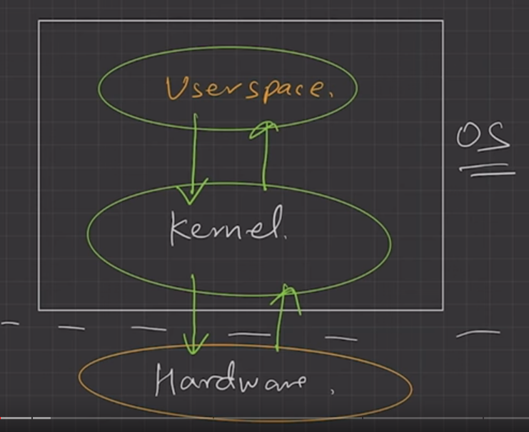

# lecture 4

## Components of OS
* User space
* Kernal space

### User space
* User apps executes here
* No hardware access
* This provides convient environment to user apps.
* Also known as GUI + CLI.
* User space interacts with kernal.
* GUI and CLI are also user sapce
* User space interacts with kernal

### Kernal
* Heart of OS.
* Interacts with hardware.
* Kernal has access to underlying hardware

**Functions of Kernal**
* Process management 
    * Process creation, termination
    * Scheduling processes and threads
    * Process synchronization
    * Process communication (because process are isolated, kernal helps process to communicate with each other)
* Memory management
    * Allocate / Deallocate
    * Managing free space
* File management
    * create / delete files
    * directory management
* I/O management
    * Spooling
    * Buffering
    * Caching

**Types of Kernal**
* Monolithic kernal
    * 

